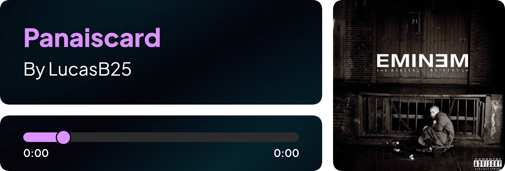
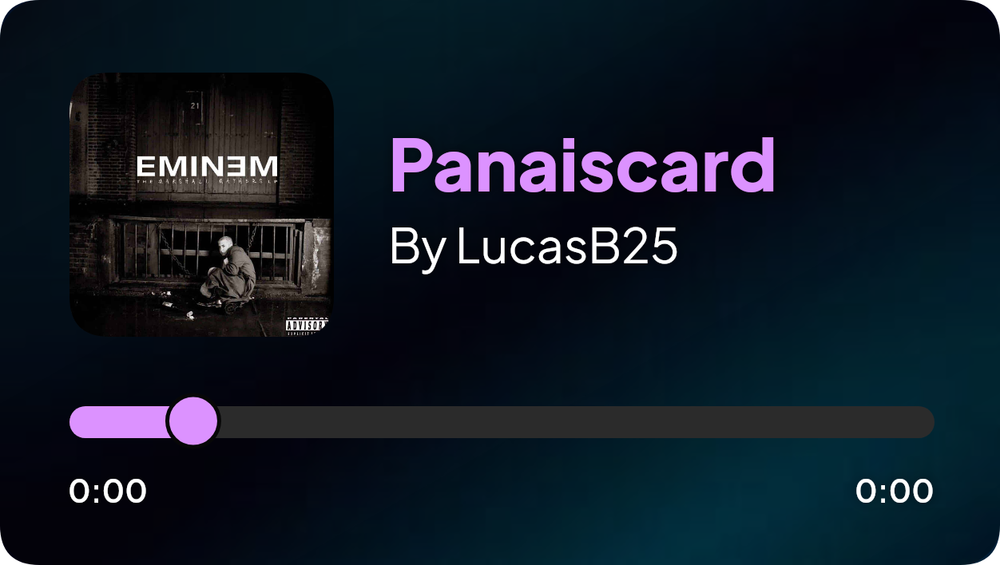
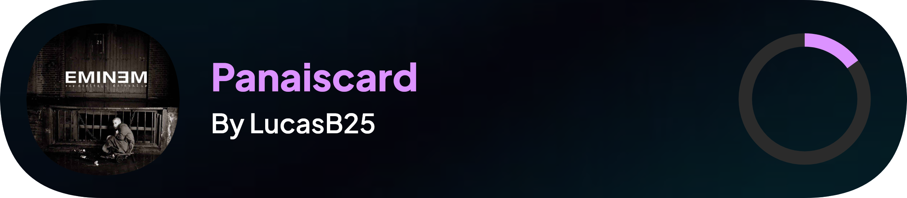
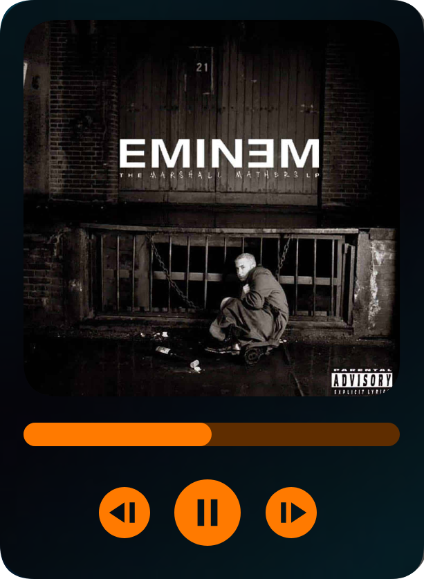

<p align="center">
  
</p>

[![Version][version-shield]](version-url)
[![NPM][npm-shield]][npm-url]
[![Contributors][contributors-shield]][contributors-url]
[![Forks][forks-shield]][forks-url]
[![Stargazers][stars-shield]][stars-url]
[![Issues][issues-shield]][issues-url]
[![Support Server][support-shield]][support-server]
[![MIT License][license-shield]][license-url]

---

<h1 align="center">🎵 PanaisCard 🎵</h1>

<p align="center">A powerful Node.js package to generate stunning music cards for Discord bots</p>

## 🚀 Installation

```sh
# Using npm
npm install panaiscard

# Using yarn
yarn add panaiscard
```

## 🎨 Features
- Generate beautiful music cards effortlessly
- Multiple themes to choose from
- Fully customizable options (background, colors, text, etc.)
- Ideal for Discord bots and web applications

---

## 📌 Basic Usage

```js
const { Classic } = require('panaiscard');
const fs = require('fs');

Classic({}).then(imageBuffer => {
    fs.writeFileSync('output.png', imageBuffer);
});
```

## 🤖 Discord Bot Integration

```js
const { Classic } = require("panaiscard");
const fs = require("fs");

const panaiscard = await Classic({});

return message.channel.send({
    files: [{ attachment: panaiscard }]
});
```

## 🎭 Custom Background Support

```js
const { Classic } = require('panaiscard');
const fs = require('fs');

Classic({
    thumbnailImage: 'https://example.com/thumbnail.png',
    backgroundImage: 'https://example.com/background.png',
    imageDarkness: 60,
    nameColor: '#DC92FF',
    progressColor: '#DC92FF',
    progressBarColor: '#2B2B2B',
    progress: 50,
}).then(imageBuffer => {
    fs.writeFileSync('output.png', imageBuffer);
});
```

## 🎨 Available Themes

### 🔹 Classic


```js
const { Classic } = require('panaiscard');
const fs = require('fs');

const panaiscard = await Classic({
    thumbnailImage: 'https://hiphopcorner.fr/wp-content/uploads/2016/05/image-eminem-cover-album-marshall-mathers-lp.jpg',
    backgroundColor: '#070707',
    progress: 10,
    progressColor: '#FF7A00',
    progressBarColor: '#5F2D00',
    title: 'Without Me',
    titleColor: '#FF7A00',
    author: 'Eminem',
    authorColor: '#696969',
    startTime: '0:00',
    endTime: '4:00',
    timeColor: '#FF7A00',
});

fs.writeFileSync('panaiscard.png', panaiscard);
```

### 🔹 ClassicPro


```js
const { ClassicPro } = require('panaiscard');
const fs = require('fs');

const panaiscard = await ClassicPro({
    thumbnailImage: 'https://hiphopcorner.fr/wp-content/uploads/2016/05/image-eminem-cover-album-marshall-mathers-lp.jpg',
    backgroundColor: '#070707',
    progress: 10,
    progressColor: '#FF7A00',
    progressBarColor: '#5F2D00',
    title: 'Without Me',
    titleColor: '#FF7A00',
    author: 'Eminem',
    authorColor: '#696969',
    startTime: '0:00',
    endTime: '4:00',
    timeColor: '#FF7A00',
});

fs.writeFileSync('panaiscard.png', panaiscard);
```

### 🔹 Dynamic


```js
const { Dynamic } = require('panaiscard');
const fs = require('fs');

const panaiscard = await Dynamic({
    thumbnailImage: 'https://hiphopcorner.fr/wp-content/uploads/2016/05/image-eminem-cover-album-marshall-mathers-lp.jpg',
    backgroundColor: '#070707',
    progress: 10,
    progressColor: '#FF7A00',
    progressBarColor: '#5F2D00',
    title: 'Without Me',
    titleColor: '#FF7A00',
    author: 'Eminem',
    authorColor: '#696969',
});

fs.writeFileSync('panaiscard.png', panaiscard);
```

### 🔹 Mini


```js
const { Mini } = require('panaiscard');
const fs = require('fs');

const musicard = await Mini({
    thumbnailImage: 'https://hiphopcorner.fr/wp-content/uploads/2016/05/image-eminem-cover-album-marshall-mathers-lp.jpg',
    backgroundImage: fs.readFileSync('bg.png'),
    imageDarkness: 70,
    author: 'Testing by UG',
    title: 'Bad Boy (feat. Luana Kiara)',
    trackIndexBackgroundRadii: [10, 20, 30, 40, 50, 60, 70, 80, 80, 100],
});

fs.writeFileSync('panaiscard.png', panaiscard);
```

## 🤝 Contributing
Want to improve PanaisCard? Follow these steps:

1. Fork the repository
2. Create a new feature branch
3. Implement your changes with proper documentation
4. Submit a pull request

## 💖 Contributors

Thanks to these amazing contributors:

<a href="https://github.com/LucasB25/panaiscard/graphs/contributors">
  
</a>

## 📜 License
This project is licensed under the MIT License - see the [![MIT License][license-shield]][license-url] file for details.


[version-shield]: https://img.shields.io/github/package-json/v/LucasB25/panaiscard?style=for-the-badge
[npm-shield]: https://img.shields.io/npm/v/panaiscard.svg?maxAge=3600&style=for-the-badge
[npm-url]: https://www.npmjs.com/package/panaiscard
[contributors-shield]: https://img.shields.io/github/contributors/LucasB25/panaiscard.svg?style=for-the-badge
[contributors-url]: https://github.com/LucasB25/panaiscard/graphs/contributors
[forks-shield]: https://img.shields.io/github/forks/LucasB25/panaiscard.svg?style=for-the-badge
[forks-url]: https://github.com/LucasB25/panaiscard/network/members
[stars-shield]: https://img.shields.io/github/stars/LucasB25/panaiscard.svg?style=for-the-badge
[stars-url]: https://github.com/LucasB25/panaiscard/stargazers
[issues-shield]: https://img.shields.io/github/issues/LucasB25/panaiscard.svg?style=for-the-badge
[issues-url]: https://github.com/LucasB25/panaiscard/issues
[license-shield]: https://img.shields.io/github/license/LucasB25/panaiscard.svg?style=for-the-badge
[license-url]: https://github.com/LucasB25/panaiscard/blob/main/LICENSE
[support-server]: https://discord.gg/nvcznzhkTF
[support-shield]: https://img.shields.io/discord/942117923001098260.svg?style=for-the-badge&logo=discord&colorB=7289DA
